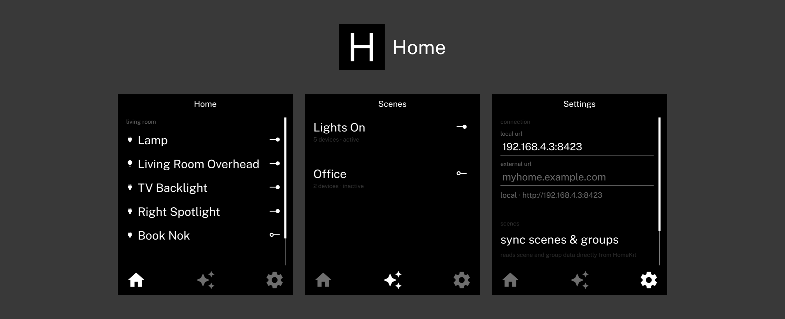

A minimal HomeKit Controller for the Light Phone 3

## Required

Controls HomeKit devices via the [ItsyHome](https://github.com/nickustinov/itsyhome-macos) macOS web API. (Web API is a premium service, one-time purchase, for  itsyhome)

## Features

- **Rooms** — devices grouped by room, with smart group detection via calibration
- **Scenes** — trigger HomeKit scenes, with accurate active/inactive/modified/partial status
- **Settings** — local URL (primary) + external URL (fallback), connection status
- **Calibration** — automatic device-to-scene and device-to-group fingerprinting

## Bugs

- States can occasionally become out of sync

## Setup

1. Install [ItsyHome](https://github.com/nickustinov/itsyhome-macos) on your Mac and start the web server
2. install the app
3. Open Settings and enter your local URL (e.g. `192.168.1.x:8423`)
4. Go to Settings → Calibrate Scenes — your lights will flash briefly
5. Navigate to Rooms and Scenes — everything should be grouped and labelled correctly

## To-Do

- Hopefully not have to use itsyhome for HomeKit Controls
- More controls outside of Lights & Outlets

## How it works

### Connection
The app connects to ItsyHome's local web API. It tries the local URL first and falls back to the external URL if unreachable. Both are configurable in Settings.

### Scene status
Scenes show one of four states based on comparing current device state to fingerprinted targets (±5 tolerance):
- **active** — all devices match the scene's target values
- **inactive** — all devices off
- **modified** — devices are on but values differ from scene targets (e.g. brightness changed manually)
- **partial** — mix of on and off devices

Tapping a scene triggers it if not active, or turns all devices off if active.

### Groups
Devices belonging to the same fingerprinted group are rendered as a single row in the Rooms tab. The group icon reflects the device type — lightbulb for lights, plug for outlets, and a devices icon for mixed groups.
